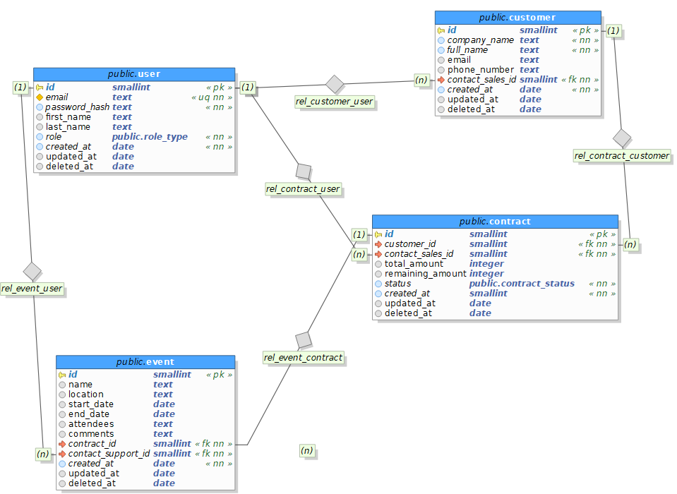
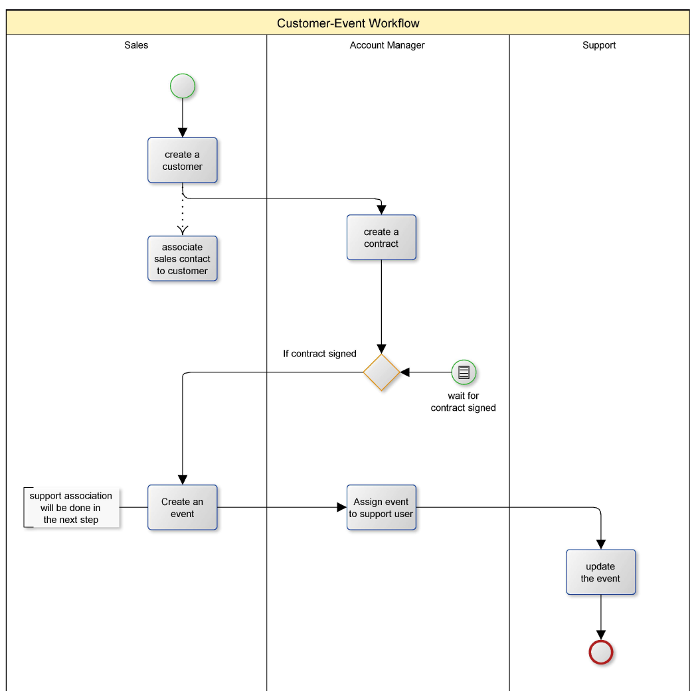
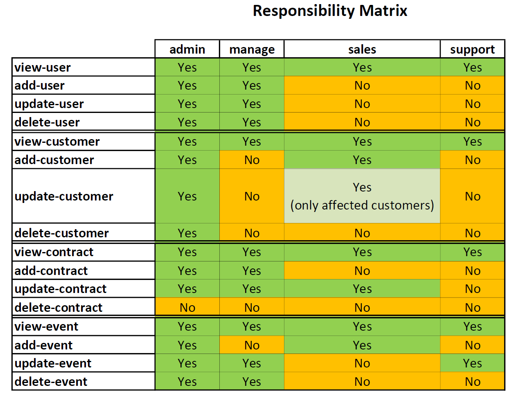

# Développez une architecture back-end sécurisée avec Python et SQL

## Sommaire

-   [Développez une architecture back-end sécurisée avec Python et SQL](#développez-une-architecture-back-end-sécurisée-avec-python-et-sql)
    -   [Sommaire](#sommaire)
    -   [À propos](#à-propos)
    -   [Prérequis](#prérequis)
    -   [Langages \& Librairies](#langages--librairies)
    -   [Installation](#installation)
    -   [Paramétrage de l'environnement](#paramétrage-de-lenvironnement)
    -   [Création de la base de données](#création-de-la-base-de-données)
    -   [Création de l'environnment de test (facultatif)](#création-de-lenvironnment-de-test-facultatif)
    -   [Utilisation](#utilisation)
    -   [MCD (Modèle Conceptuel des Données)](#mcd-modèle-conceptuel-des-données)
    -   [workflow \& matrice de responsabilité](#workflow--matrice-de-responsabilité)
    -   [Gestion des versions](#gestion-des-versions)
    -   [Licence](#licence)

## À propos

Formation OpenClassRooms - Architecture back-end - Projet 12

Objectifs :

-   Modélisation et sécurisation d'une base de donnée SQL (postgresql)
-   Mettre en place une architecture back-end sécurisée d'authentification
-   Utilisation d'outils de journalisation (Sentry)

## Prérequis

Avoir accès a postgresql (installation locale ou distante) pour la BDD.

Nécessite un compte Sentry pour la journalisation

## Langages & Librairies

-   [Python](https://www.python.org/) 3.12.7
-   [Click](https://click.palletsprojects.com/en/stable/) et [Rich](https://rich.readthedocs.io/en/stable/introduction.html) pour l'IHM en ligne de commande
-   [PyJWT](https://pyjwt.readthedocs.io/en/stable/) & [argon2-cffi](https://argon2-cffi.readthedocs.io/en/stable/) pour la partie authentification (tokens et hash des mots de passe)
-   [Pydantic](https://docs.pydantic.dev/latest/) pour la validation des données
-   [SQLAlchemy](https://www.sqlalchemy.org/)
-   [PostgreSQL](https://www.postgresql.org/) 16.4.1
-   [Sentry](https://sentry.io) pour la journalisation

## Installation

Cloner le repository

```bash
git clone git@github.com:Mothraa/CRM-App_CLI-pgSQL.git
```

Créer l'environnement virtuel avec [venv](https://docs.python.org/fr/3.9/library/venv.html)

```bash
python -m venv .venv
```

Activer l'environnement

-   sous linux ou mac

```bash
source .venv/bin/activate
```

-   sous windows

```bash
.venv/scripts/activate
```

Installer les packages

```bash
pip install -r requirements.txt
```

## Paramétrage de l'environnement

-   renommer le fichier ".env.template" en ".env" (ou créer des variables d'environnement)
-   modifier la configuration du fichier ".env"

## Création de la base de données

Des scripts (répertoire \scripts) permettent la mise en place de la base de données

-   Création de la base et des tables (vide) - via compte superadmin

```bash
python scripts/1_create_db_schema_tables.py
```

-   Création du compte admin de l'app, application des privilèges - via compte superadmin

```bash
python scripts/2_create_db_schema_tables.py
```

## Création de l'environnment de test (facultatif)

Des scripts permettent de peupler la base de données fictives :

-   comptes tests fictifs pour chaque profil utilisateur :

```bash
python scripts/3_seed_test_users.py
```

Le mot de passe par défaut est commun a tous les comptes et modifiable dans le script.

-   peuplement de données fictives (avec la lib Faker) :

```bash
python scripts/4_seed_fake_data.py
```

Le nombre d'entité ajouté est paramétrable dans le script.

**_Note_** : pour l'execution des tests d'intégration, une copie de la base est a réaliser.

```SQL
CREATE DATABASE my_test_db WITH TEMPLATE my_db;
```

Vous serez peut être amenés a forcer la fermeture des connexions actives.

```SQL
DO $$
BEGIN
    PERFORM pg_terminate_backend(pid)
    FROM pg_stat_activity
    WHERE datname = 'my_db' AND pid <> pg_backend_pid();
END $$;
```

## Utilisation

L'ensemble des commandes sont disponibles depuis l'execution du fichier run.py.
Une option d'aide est disponible :

```bash
python src/run.py --help
```

Un résumé des commandes est disponible : [Guide utilisateur](docs/user_guide.md)

## MCD (Modèle Conceptuel des Données)

[](docs/20241031_mcd_app_crm.png)

## workflow & matrice de responsabilité

[](docs/20241031_bpmn_customer-event_workflow.pdf)

[](docs/20241031_responsibility_matrix.pdf)

## Gestion des versions

La dénomination des versions suit la spécification décrite par la [Gestion sémantique de version](https://semver.org/lang/fr/)

Les versions disponibles ainsi que les journaux décrivant les changements apportés sont disponibles depuis [la section releases](https://github.com/Mothraa/OCR_projet10/releases)

## Licence

Voir le fichier [LICENSE](./LICENSE.md) du dépôt.
